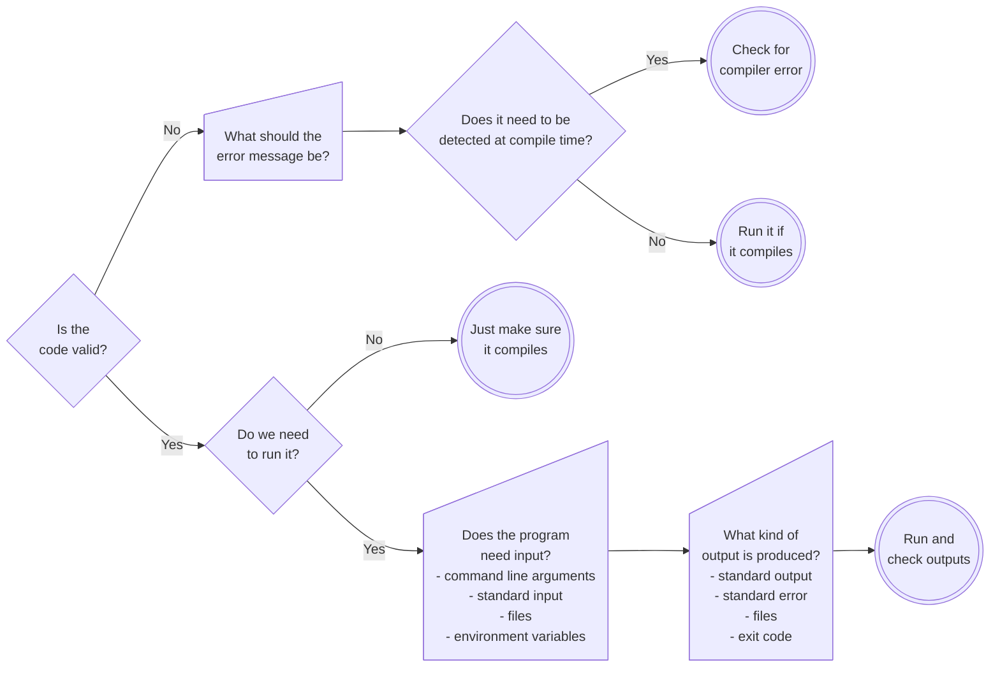

Community-Driven Fortran Compiler Test Suite
============================================

This repository contains a framework and suite of cases for testing a Fortran compiler with the primary goals of

1. Making it easy for the Fortran community to add tests and
2. Making it easy to use the framework with a broad range of compilers.

# Usage

```text
usage: run_tests.py [-h] [-i INPUT] [-o OUTPUT] [-c COMPILER] [-C C_COMPILER] [-v] [-f FLAGS [FLAGS ...]]

Run the Fortran compiler test suite

options:
  -h, --help            show this help message and exit
  -i INPUT, --input INPUT
                        Directory to search for the tests (default: tests)
  -o OUTPUT, --output OUTPUT
                        Where to put the test results (default: results)
  -c COMPILER, --compiler COMPILER
                        The compiler to test (default: gfortran)
  -C C_COMPILER, --c-compiler C_COMPILER
                        The companion C processor (default: depends on Fortran compiler)
  -v, --verbose         Print additional details about each test case to the screen.
                        Passing once prints the pass/fail status of each test case.
                        Passing twice includes any failing checks for each test case.
                        Passing a third time includes all checks for a test case.
                        Passing a fourth time outputs the full detailed report for each test case.
                        (default: 0)
  -f FLAGS [FLAGS ...], --flags FLAGS [FLAGS ...]
                        The default flags to use for compilation (default: None)

```

Note that the detailed information for each test case is saved in its output folder in a file named `outcome.txt`.
A summary of the outcome will be reported to the screen,
and passing the `-v` option will add increasing levels of detailed output about each test case to the screen output.

# Contributing a Test

> TODO: We still need to figure out a good organization strategy for the test cases.
> There should be some hierarchy for where test cases go,
> and a naming convention for the test case folders.

At an appropriate location with the `tests` directory

* create a folder with an appropriate name with contents
* a `config.yml` file with contents as outlined below
* the appropriate source file(s)

Some places one might find ideas for test cases to be added to this suite are:

* Bugs reported to different compilers
* Open source compiler test suites
* Interpretation requests submitted to the standards committee

The following flowchart should help identify aspects to think about when setting the options described below for the `config.yml` file.



## Contents of a `config.yml` file

The `config.yml` file contains YAML formatted data defining the attributes of the test case.
YAML is a fairly well standardized format, which you can find a good description of [here](https://yaml.org/spec/1.2.2/).
Briefly, it is a file that contains a list of key-value pairs, where the values may be arrays of values, or themselves lists of key-value pairs.
This framework expects to find the following keys.

* `description`, required - A string that describes the features of the test case
* `features`, optional - An array of strings identifying various features of the language being tested
* `source_files`, required - An array of strings identifying the source files, in the order in which they are to be compiled
* `other_files`, optional - An array of strings identifying any additional files needed by the test case
* `command_line_arguments`, optional - An array of strings which should be passed as command line arguments when running the resulting executable
* `standard_input`, optional - A string which should be provided as standard input when running the resulting executable
* `environment_variables`, optional - A set of key-value pairs, where the key is the name of the environment variable, and the value is what it's value should be when running the resulting executable
* `num_images`, optional - The number of images that the resulting executable should be launched with
* `allowed_not_to_detect`, optional, default=`false` - `true` or `false` defining whether a processor is allowed to not detect a violation of the standard
* `uses_optional_feature`, optional, default=`false` - `true` or `false` defining whether the test case uses a feature of the language not required to be supported
* `uses_extension`, optional, default=`false` - `true` or `false` defining whether the test case uses a feature not defined by the standard
* `expected`, required - A set of key-value pairs describing the expected behavior of the test case
  * `compile`, required - `true` or `false`, the code should successfully compile
  * `compiler_error`, optional - If `compile` is `false`, an array of regular expressions that the output should match
  * `compile_only`, optional, default=`false` - If `true`, do not attempt to run the resulting executable
  * `normal_termination`, required iff `compile` is `true` and `compile_only` is `false` - `true` if the resulting executable should terminate with an exit code of 0 when run
  * `exit_code`, optional, default=0 - an integer specifying the expected exit code if `normal_termination` is false
  * `stdout`, optional - an array of regular expressions that should match the output produced to standard output from compilation and/or execution
  * `stderr`, optional - an array of regular expressions that should match the output produced to standard error from compilation and/or execution
  * `either_output`, optional - an array of regular expressions that should match one of either `stdout` or `stderr`. Most useful when `normal_termination` is `false`, as it may be processor dependent to which output stream a message is sent
  * `output_files`, optional - A set of key-value pairs where the key is the name of a file expected to be output, and the value is an array of regular expressions expected to match the contents of that file.

<!--
TODO: Should there be a way for a test case to specify that it needs particular compiler
      flags for a given compiler?
-->

# Anatomy of a Good Test Case

A test case should be small and focused.
It should include a small subset of the features of the language,
ideally focused on testing a single feature, constraint, or syntax element.
To the extent possible, let the framework check the outputs as this should provide maximum feedback to users of the test suite.
Minimize the size of the config file, i.e. only specify what is required and relevant.

# Compiler Configuration

Ideally compilers would support all the Fortran features by default and not need any special configuration.
Unfortunately the world isn't ideal, and some compilers need special flags to enable and use some features.
The configurations for supported/known compilers are listed in the file `framework/compiler_configurations.yml`.
The schema for this is as follows:

```yaml
compiler_name:
  c_compiler: "c-compiler-name"
  default_flags: ["flags", "to", "use", "for", "all", "tests"]
  feature_flags:
    feature name:
      flags: ["flags", "to", "use", "for", "cases", "with", "this", "feature"]
      env_vars:
        environment: "variables"
        to: "set"
        for: "case"
        with: "this feature"
```

Note that the special string `{num_images}` will be replaced with the number of
images that a test case is run with.

# Copyright

Fortran Compiler Test Suite Copyright (c) 2024, The Regents of the University of California, through Lawrence Berkeley National Laboratory (subject to receipt of any required approvals from the U.S. Dept. of Energy). All rights reserved.

If you have questions about your rights to use or distribute this software,
please contact Berkeley Lab's Intellectual Property Office at IPO@lbl.gov.

NOTICE.  This Software was developed under funding from the U.S. Department of Energy and the U.S. Government consequently retains certain rights.
As such, the U.S. Government has been granted for itself and others acting on its behalf a paid-up, nonexclusive, irrevocable, worldwide license in the Software to reproduce, distribute copies to the public, prepare derivative  works, and perform publicly and display publicly, and to permit others to do so.